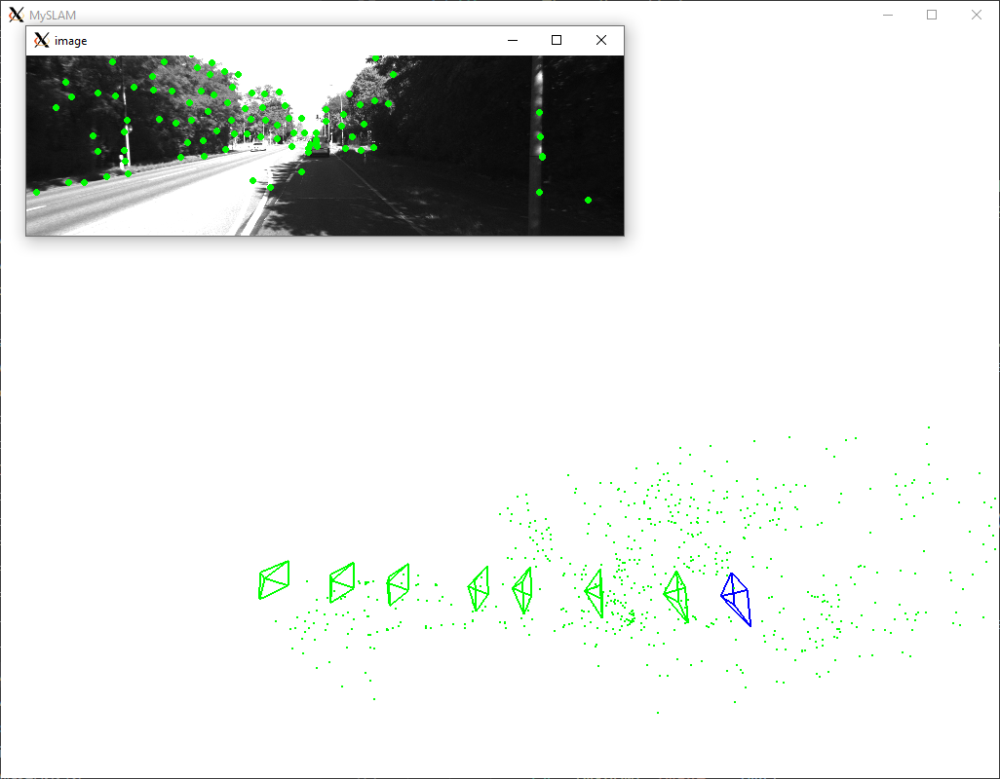

# Stereo_VisualOdometry_Backend

This repo is modified from gaoxiang12's [slambook2/ch13](https://github.com/gaoxiang12/slambook2/tree/master/ch13). This repo is a VO (Visual Odometry) with local backend for stereo stream. It could track the camera's poses and the keypoints in space and render them with pangolin.

## Requirements

* C++ 11
* CMake
* Opencv: 3.1
* Pangolin: commit [1ec721d](https://github.com/stevenlovegrove/Pangolin/tree/1ec721d59ff6b799b9c24b8817f3b7ad2c929b83)
* Sophus: commit [13fb328](https://github.com/strasdat/Sophus/tree/13fb3288311485dc94e3226b69c9b59cd06ff94e)
* G2O: commit [9b41a4e](https://github.com/RainerKuemmerle/g2o/tree/9b41a4ea5ade8e1250b9c1b279f3a9c098811b5a)
* googletest: commit [3f5b5b8](https://github.com/google/googletest/tree/3f5b5b8f8493a03fa25f1e4a7eae7678514a431d)

## Dataset

[KITTI Dataset](http://www.cvlibs.net/datasets/kitti/eval_odometry.php)

## Work Flow

This repos has front end and backend. VO (front end) read frames and calculate the poses of camera, build map. Backend optimizes the keyframes and mappoints. The workflow is as the following image.

### Front end

* Initialize the map
    * Extract `keypoints` from first `left` frame
    * Find corresponding `keypoints` in first `right` frame by optical flow
    * Calculate corresponding `mappoints` in world based on `keypoints` from first `left` and `right` frames through triangulation
    * Put `mappoints` into map
    * Take `left` frame as `keyframe` and put into map, trigger the backend
* Calculate the pose of current frame
    * Find corresponding `keypoints` in current `left` frame to last `left` frame by optical flow
    * Calculate curren pose by 3D-2D BA
        * 3D points are `mappoints` of last frame `keypoints`
        * 2D points are current frame `keypoints`
        * Initial guess is calculated by last 2 frames relative motion and last frame's pose
        * Vertex is the pose with initial guess
        * Edges are unary edge with mappoints world coordiante as memebers and 2D key-point pixel coordiante as measurement
        * Update relative motion with final calculated pose and last frame's pose
    * If the number of good tracked point is low, defines current left frame as new `keyframe`
        * Do the initialization work for this two `left` and `right` frames
        * Insert new `mappoints` and `keyframe`
        * Trigger the backend

### Backend

Backend is a Bundle Adjustment for active poses and mappoints. This repo only keeps maximum 7 poses (7 keyframes) and corresponding mappoints for optimization, so it is a local backend. It runs in a spereate process to the front end and listen to trigger from front end. Once it is triggered, it reads active keyframes (poses) and mappoints from the maps and build the optimization problem with G2O library. The structure of graph optimization is as follows.

* Poses Vertex
   * Uses VO's data as initial value
* Mappoint Vertex
   * Uses maps data as initial value
* Edges
   * Binaray edge, conntecting to a pose vertex and a mappoint vertex
   * The pixel coordiante of key-point as the measurement
